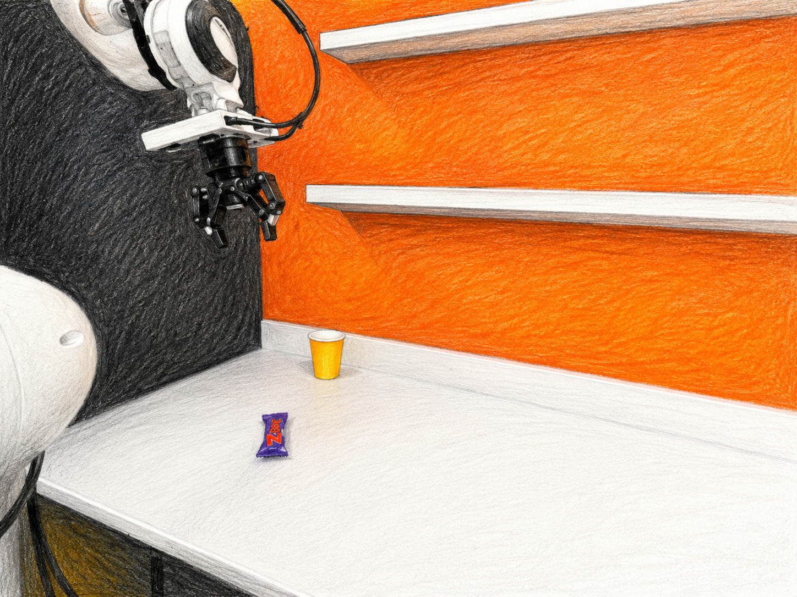
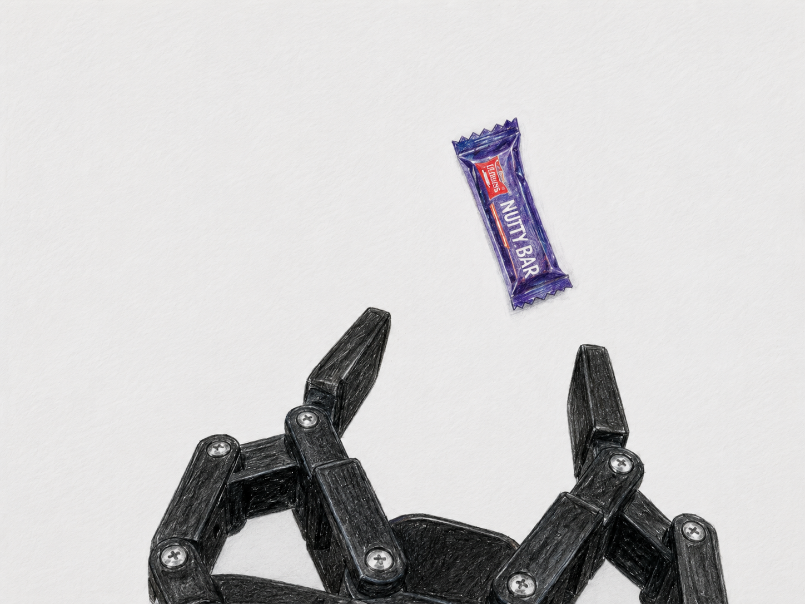
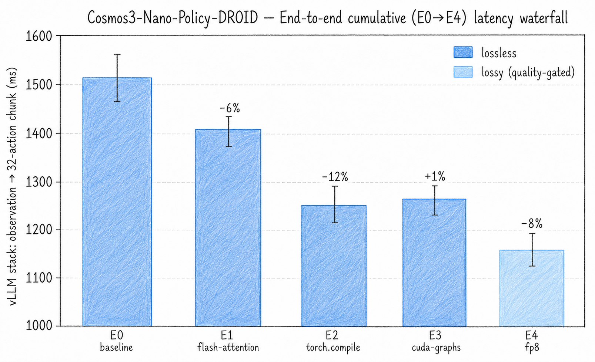
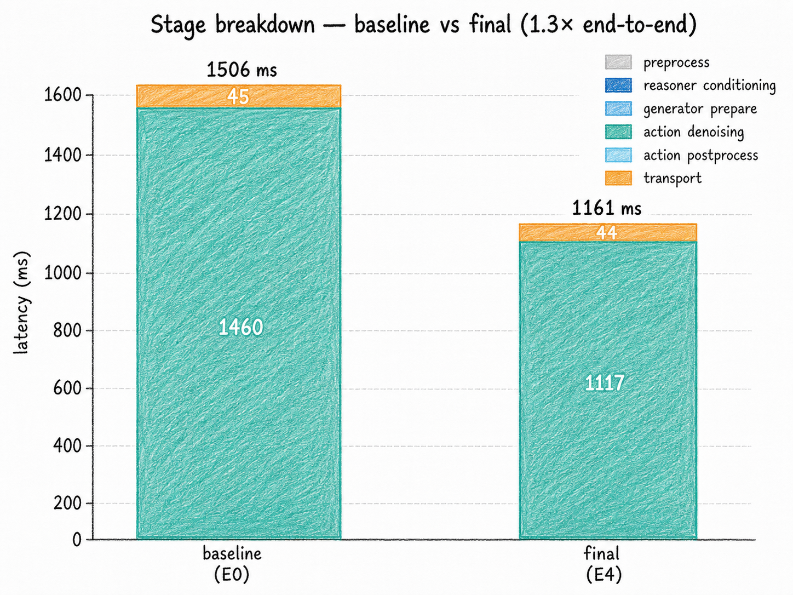
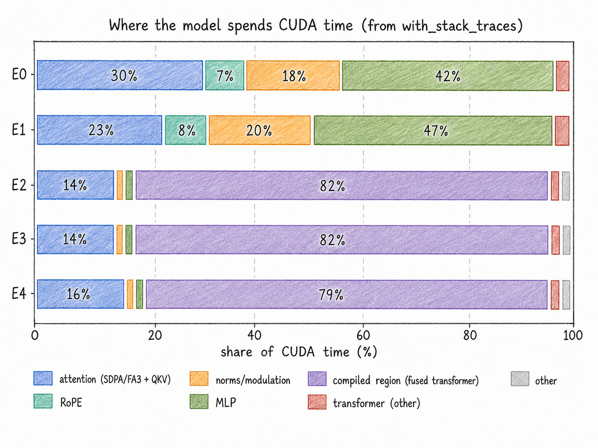
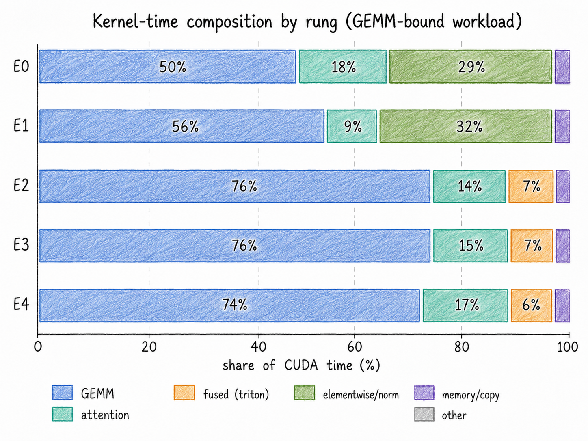

# Serving and benchmarking Cosmos3-Nano-Policy-DROID

**A robot cannot wait for the next token.** To act, a policy must combine camera views, a
language instruction, and robot state, then return an action chunk quickly enough to remain
inside the control loop.

This repository is a reproducible example of serving
`Cosmos3-Nano-Policy-DROID` with vLLM / vLLM-Omni and measuring its
observation-to-action latency on an NVIDIA H100.

<table>
  <tr>
    <td width="33%"></td>
    <td width="33%"></td>
    <td width="33%"></td>
  </tr>
  <tr>
    <td align="center"><sub>Exterior camera 1</sub></td>
    <td align="center"><sub>Exterior camera 2</sub></td>
    <td align="center"><sub>Wrist camera</sub></td>
  </tr>
</table>

The repository illustrates the complete serving loop:

1. Package and deploy the policy.
2. Validate the endpoint before measuring it.
3. Replay the same DROID observations across optimization configurations.
4. Record end-to-end latency, server stages, environment metadata, and GPU traces.
5. Test the pipeline locally and quality-gate lossy optimizations.

## Serving best practices demonstrated here

| Practice | How it is applied |
|---|---|
| **Reproducible configuration** | Model settings and E0–E4 flags live in versioned config files. The run records package versions, engine flags, GPU details, seeds, and configuration order. |
| **Representative inputs** | Every configuration receives the same 50 observations from DROID, the dataset used to post-train this checkpoint. |
| **Warm-up before measurement** | Compilation, autotuning, and graph capture happen during 50 discarded warm-up requests. |
| **Separate profiling from timing** | Reported latency comes from unprofiled requests. One additional request is traced afterward for attribution, so profiler overhead does not bias the result. |
| **Layered observability** | The harness records client wall time, server stage durations, one JSONL row per request, system metadata, and vLLM-Omni traces viewable in Perfetto. |
| **Test before spending GPU time** | A mock backend exercises the full logging and plotting pipeline locally; unit tests verify the harness. |
| **Quality-gate lossy changes** | E0–E3 are intended to preserve the model computation. E4 uses FP8 and is accepted only after a separate closed-loop RoboLab comparison. |
| **Clean resource lifecycle** | Deployment waits for readiness, sends a smoke request, and provides an explicit teardown command. |

## Optimization waterfall

The configurations are cumulative: each row keeps the techniques introduced above it.
This makes the change between adjacent configurations easier to interpret.

| Configuration | Adds | Why it should help one request | Observed change from previous row |
|---|---|---|---:|
| **E0 — baseline** | BF16 eager execution with `TORCH_SDPA` | Establishes the reference serving path. | — |
| **E1 — FlashAttention** | `FLASH_ATTN` | Avoids materializing the full attention matrix and reduces GPU memory traffic. | **−6%** |
| **E2 — torch.compile** | Compilation and kernel fusion | Combines small elementwise and normalization operations, reducing launches and intermediate memory traffic. | **−12%** |
| **E3 — CUDA graphs** | Capture and replay for graph-eligible execution | Reduces CPU launch overhead for repeated execution. | **+1%** |
| **E4 — FP8** | Dynamic FP8 for supported kernels | Reduces memory traffic and accelerates supported Tensor Core work. It is lossy and must be quality-gated. | **−8%** |

The list is shorter than a typical LLM-serving optimization matrix. Several
diffusion-specific techniques—faster samplers, step distillation, feature caching, and
specialized serving systems—are active research areas, but they are not yet drop-in,
validated options for this policy and serving path.

## Reproduce the benchmark

### 1. Check the pipeline locally

No GPU is needed for the smoke test:

```bash
uv sync
uv run python run_matrix.py --smoke \
  --input-manifest policy/mock/manifest.json \
  --output-dir results-smoke \
  --backend mock \
  --configurations E0,E1,E2,E3,E4
uv run python aggregate.py --out-dir results-smoke
uv run --group dev pytest -q
```

The mock run validates request replay, structured logs, aggregation, and figure generation.

### 2. Run E0–E4 on one H100

The prepared SkyPilot job captures the DROID replay set, starts the vLLM / vLLM-Omni
serving path, runs all five configurations, and uploads the results:

```bash
export HF_TOKEN=<hugging-face-token>
sky jobs launch jobs/job2-production-validation.sky.yaml --secret HF_TOKEN \
  --env CONFIGS=E0,E1,E2,E3,E4
```

The reported statistic is median batch-one end-to-end latency over 50 measured requests,
with 95% bootstrap confidence intervals. Each configuration first runs 50 warm-up requests.
The client and server run in the same Nebius Cloud job, and each request is timed from
observation submission until the complete `[32, 8]` action chunk is returned.

### 3. Download and analyze the outputs

Copy the uploaded measurements and traces from S3:

```bash
set -a
source .env
set +a

aws s3 cp \
  s3://serverless-challenge/cosmos3-ablation-results/production/raw/ \
  results/ --recursive --endpoint-url "$AWS_ENDPOINT_URL"
```

Regenerate the plots and trace attribution:

```bash
uv run python aggregate.py --out-dir results
uv run python analyze_traces.py --results-dir results --traces results/traces
```

Open the generated Chrome/JSON traces in [Perfetto](https://ui.perfetto.dev/) to inspect
kernel launches, CPU/GPU overlap, and model-stage execution.

## Serve the optimized policy as an endpoint

The benchmark job manages its own serving process. To deploy E4 as a reusable serverless
endpoint, build the serving image and launch it with the provided helper:

```bash
bash deploy/install_npa.sh
npa configure --interactive
export HF_TOKEN=<hugging-face-token>

REG=cr.eu-north1.nebius.cloud/e00k6drmprp0pm6zcf
docker build --platform linux/amd64 -f deploy/Dockerfile.serve \
  -t "$REG/cosmos-droid-vllm:v5" .
docker push "$REG/cosmos-droid-vllm:v5"

MODE=optimized IMAGE="$REG/cosmos-droid-vllm:v5" \
  bash jobs/deploy-optimized.sh
```

The deployment waits for readiness and sends a smoke request. To benchmark an existing
endpoint with your own replay manifest:

```bash
uv run python run_matrix.py --backend vllm \
  --endpoint https://<endpoint> \
  --input-manifest /path/to/manifest.json \
  --output-dir results-endpoint \
  --configurations E4
uv run python aggregate.py --out-dir results-endpoint
```

Stop the endpoint when the experiment is complete:

```bash
npa workbench cosmos -p eu-north1 -n cosmos-policy-optimized teardown --yes
```

## Results

The full cumulative stack reduced median observation-to-action latency from **1,506 ms to
1,161 ms**: a **23% reduction**, or about a **1.30× speedup**.

The first row shows unprofiled end-to-end results. The second row uses the separate profiler
request to explain where GPU time is spent.

<table>
  <tr>
    <td width="50%" align="center"><br><sub>End-to-end latency waterfall</sub></td>
    <td width="50%" align="center"><br><sub>Pipeline-stage breakdown</sub></td>
  </tr>
  <tr>
    <td width="50%" align="center"><br><sub>CUDA time by model component</sub></td>
    <td width="50%" align="center"><br><sub>Kernel-time composition</sub></td>
  </tr>
</table>

What the plots show:

- **FlashAttention helps, but attention is only part of the block.** E1 improves latency by
  about 6%.
- **Compilation provides the largest non-quantized gain.** E2 removes fragmented
  elementwise and normalization work and cuts another 12%.
- **CUDA graphs are effectively flat here.** Most latency remains in large diffusion
  kernels, so reducing CPU launch overhead does not materially improve one-request latency.
- **FP8 accelerates the dominant compute path.** E4 cuts another 8%, but this result is a
  candidate until policy quality is validated.
- Almost the entire 345 ms reduction appears in server-side policy generation; transport
  remains essentially unchanged. After E4, the workload is still GEMM-bound.

## Quality gate

Latency alone is not sufficient for a robotics policy. The optional
[RoboLab job](jobs/job3-robolab-subset.sky.yaml) compares E0 and E4 in closed-loop
simulation on 18 tasks, with matched settings and 10 episodes per task. E4 passes only if
its overall task-success rate is no more than three percentage points below E0.

## Key files

- [config/experiment.yaml](config/experiment.yaml) — dataset, sampling, warm-up, seeds, and
  reporting settings.
- [policy/configs.py](policy/configs.py) — E0–E4 definitions.
- [jobs/job2-production-validation.sky.yaml](jobs/job2-production-validation.sky.yaml) —
  full H100 latency run.
- [deploy/Dockerfile.serve](deploy/Dockerfile.serve) and
  [jobs/deploy-optimized.sh](jobs/deploy-optimized.sh) — endpoint deployment.
- [aggregate.py](aggregate.py) and [analyze_traces.py](analyze_traces.py) — plots and trace
  analysis.
