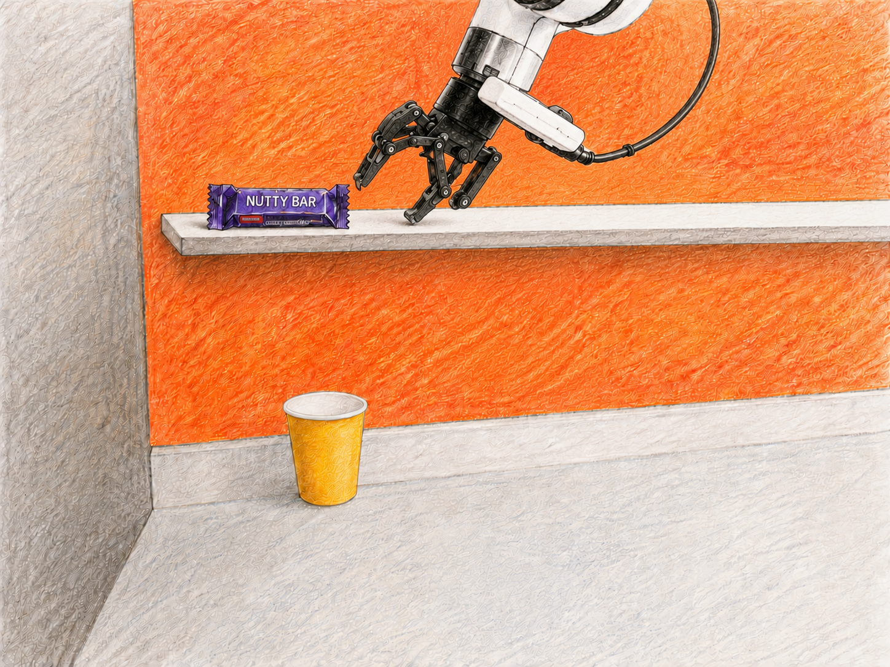

# Latency Optimization and Benchmarking of Cosmos3-Nano-Policy-DROID

A robot has only a short window to decide what to do next. To implement an instruction to place a candy bar on a shelf successfully, the policy must combine camera views, the instruction, and the robot state, then generate an action chunk fast enough to keep the control loop responsive.
This project shows how to serve that policy, observe its execution, and systematically reduce its observation-to-action latency.

This repository is a reproducible example of serving
`Cosmos3-Nano-Policy-DROID` with vLLM / vLLM-Omni and measuring its
observation-to-action latency while evaluating its task performance.

A more detailed overview of the `Cosmos3-Nano-Policy-DROID` internals is available in
[this post](https://ana-alekseeva.com/posts/cosmos3-performance-engineering).

<p align="center">
  <br>
  <sub>Exterior camera 1 · Exterior camera 2 · Wrist camera</sub>
</p>

The repository illustrates the complete serving loop:

1. Package and deploy the Cosmos3-Nano-Policy-DROID.
2. Validate the endpoint before measuring it.
3. Replay the same DROID observations across optimization configurations.
4. Record end-to-end latency, server stages, environment metadata, and GPU traces.
5. Evaluate the performance of the optimized models.
6. Test the pipeline locally.

## Serving best practices

The project follows practical serving and benchmarking best practices: versioned and reproducible configurations, representative fixed inputs, warm-up before measurement, separation of profiling from latency timing, structured per-request logs and Perfetto traces, local smoke tests and unit tests, readiness checks and explicit resource teardown, and a closed-loop quality gate for the lossy FP8 configuration.

## Optimization waterfall

The configurations are cumulative: each row keeps the techniques introduced above it.

| Configuration | Adds | Effect |
|---|---|---|---:|
| **E0 — baseline** | BF16 eager execution with `TORCH_SDPA` | Establishes the reference serving path. |
| **E1 — FlashAttention** | `FLASH_ATTN` | Avoids materializing the full attention matrix and reduces GPU memory traffic. |
| **E2 — torch.compile** | Compilation and kernel fusion | Combines small elementwise and normalization operations, reducing launches and intermediate memory traffic. |
| **E3 — CUDA graphs** | Capture and replay for graph-eligible execution | Reduces CPU launch overhead for repeated execution. | 
| **E4 — FP8** | Dynamic FP8 for supported kernels | Reduces memory traffic and accelerates supported Tensor Core work. It is lossy and must be quality-gated. | 

This is a shorter list than is common in mature LLM serving stacks. Diffusion inference is
still an active optimization area: faster samplers, step distillation, feature caching,
compression, and specialized serving systems are summarized in this
[survey of efficient diffusion models](https://openreview.net/forum?id=wHECkBOwyt). These
methods are promising, but they are not yet drop-in, validated options for this Cosmos
policy and vLLM-Omni serving path.

## Reproduce the benchmark

### 1. Check the pipeline locally

No GPU is needed for the smoke test:

```bash
uv sync
uv run python run_matrix.py --smoke \
  --input-manifest policy/mock/manifest.json \
  --output-dir results-smoke \
  --backend mock \
  --configurations E0,E1,E2,E3,E4
uv run python aggregate.py --out-dir results-smoke
uv run --group dev pytest -q
```

The mock run validates request replay, structured logs, aggregation, and figure generation.

### 2. Run E0–E4 on one H100

The prepared SkyPilot job captures the DROID replay set, starts the vLLM / vLLM-Omni
serving path, runs all five configurations, and uploads the results:

```bash
export HF_TOKEN=<hugging-face-token>
sky jobs launch jobs/job2-production-validation.sky.yaml --secret HF_TOKEN \
  --env CONFIGS=E0,E1,E2,E3,E4
```

The reported statistic is median batch-one end-to-end latency over 50 measured requests,
with 95% bootstrap confidence intervals. Each configuration first runs 50 warm-up requests.
The client and server run in the same Nebius Cloud job, and each request is timed from
observation submission until the complete `[32, 8]` action chunk is returned.

### 3. Download and analyze the outputs

Copy the uploaded measurements and traces from S3:

```bash
set -a
source .env
set +a

aws s3 cp \
  s3://serverless-challenge/cosmos3-ablation-results/production/raw/ \
  results/ --recursive --endpoint-url "$AWS_ENDPOINT_URL"
```

Regenerate the plots and trace attribution:

```bash
uv run python aggregate.py --out-dir results
uv run python analyze_traces.py --results-dir results --traces results/traces
```

Open the generated Chrome/JSON traces in [Perfetto](https://ui.perfetto.dev/) to inspect
kernel launches, CPU/GPU overlap, and model-stage execution.

## Serve the optimized policy as an endpoint

The benchmark job manages its own serving process. To deploy E4 as a reusable serverless
endpoint we use the [Nebius Physical AI workbench](https://github.com/nebius/nebius-physical-ai)
(`npa`), which provisions and serves the Cosmos3 policy on managed Nebius infrastructure.

Install `npa` separately with
`deploy/install_npa.sh`, and re-run that script after any `uv sync`. Build the serving image
and launch it with the provided helper:

```bash
bash deploy/install_npa.sh          # clone + editable-install the npa workbench (not via uv sync)
npa configure --interactive
export HF_TOKEN=<hugging-face-token>

REG=cr.eu-north1.nebius.cloud/e00k6drmprp0pm6zcf
docker build --platform linux/amd64 -f deploy/Dockerfile.serve \
  -t "$REG/cosmos-droid-vllm:v5" .
docker push "$REG/cosmos-droid-vllm:v5"

MODE=optimized IMAGE="$REG/cosmos-droid-vllm:v5" \
  bash jobs/deploy-optimized.sh
```

The deployment waits for readiness and sends a smoke request. To benchmark an existing
endpoint with your own replay manifest:

```bash
uv run python run_matrix.py --backend vllm \
  --endpoint https://<endpoint> \
  --input-manifest /path/to/manifest.json \
  --output-dir results-endpoint \
  --configurations E4
uv run python aggregate.py --out-dir results-endpoint
```

Stop the endpoint when the experiment is complete:

```bash
npa workbench cosmos -p eu-north1 -n cosmos-policy-optimized teardown --yes
```

## Results

The full cumulative stack reduced median observation-to-action latency from **1,506 ms to
1,161 ms**: a **23% reduction**, or about a **1.30× speedup**.

The first row shows unprofiled end-to-end results. The second row uses the separate profiler
request to explain where GPU time is spent.

<p align="center">
  <br>
  <sub>End-to-end latency waterfall · Pipeline-stage breakdown</sub>
</p>
<p align="center">
  <br>
  <sub>CUDA time by model component · Kernel-time composition</sub>
</p>

What the plots show:

- **FlashAttention helps, but attention is only part of the block.** E1 improves latency by
  about 6%.
- **Compilation provides the largest non-quantized gain.** E2 removes fragmented
  elementwise and normalization work and cuts another 12%.
- **CUDA graphs are effectively flat here.** Most latency remains in large diffusion
  kernels, so reducing CPU launch overhead does not materially improve one-request latency.
- **FP8 accelerates the dominant compute path.** E4 cuts another 8%, but this result is a
  candidate until policy quality is validated.
- Almost the entire 345 ms reduction appears in server-side policy generation; transport
  remains essentially unchanged. After E4, the workload is still GEMM-bound.

## Quality gate

Latency alone is not sufficient for a robotics policy. The optional
[RoboLab job](jobs/job3-robolab-subset.sky.yaml) compares E0 and E4 in closed-loop
simulation on 18 tasks, with matched settings and 10 episodes per task. E4 passes only if
its overall task-success rate is no more than three percentage points below E0.

RoboLab needs a different stack than the ablation (Isaac Sim 5.x + Isaac Lab on an RT-core
GPU such as L40S / RTX PRO 6000 — **not** H200, which has no RT cores). Deploy one endpoint
per side (baseline and optimized) with the workbench above, then run the two evaluation jobs
in parallel — one endpoint each to stay under the wall-clock budget:

```bash
sky jobs launch jobs/job3-robolab-subset.sky.yaml -c robolab-e0 \
  --env ROLE=baseline  --env COSMOS_ENDPOINT_BASELINE=https://<baseline-endpoint>
sky jobs launch jobs/job3-robolab-subset.sky.yaml -c robolab-e4 \
  --env ROLE=optimized --env COSMOS_ENDPOINT_OPTIMIZED=https://<optimized-endpoint>
```

After both jobs finish, apply the gate from the merged records (no simulator needed):

```bash
aws s3 sync "${OUTPUT_URI}raw/robolab/" results/robolab/ --endpoint-url "$AWS_ENDPOINT_URL"
uv run python run_robolab.py --backend vllm --side both --robolab-root RoboLab \
  --endpoint-baseline https://<baseline-endpoint> \
  --endpoint-candidate https://<optimized-endpoint>
```

Fill the 18 task slots in [config/robolab_tasks.yaml](config/robolab_tasks.yaml) first — the
job refuses to start otherwise.

## Key files

- [config/experiment.yaml](config/experiment.yaml) — dataset, sampling, warm-up, seeds, and
  reporting settings.
- [policy/configs.py](policy/configs.py) — E0–E4 definitions.
- [jobs/job2-production-validation.sky.yaml](jobs/job2-production-validation.sky.yaml) —
  full H100 latency run.
- [deploy/Dockerfile.serve](deploy/Dockerfile.serve) and
  [jobs/deploy-optimized.sh](jobs/deploy-optimized.sh) — endpoint deployment.
- [aggregate.py](aggregate.py) and [analyze_traces.py](analyze_traces.py) — plots and trace
  analysis.

<p align="center">
  <br>
  <em>I hope your robot completes its task as reliably as mine did — and a little faster, too.</em>
</p>
